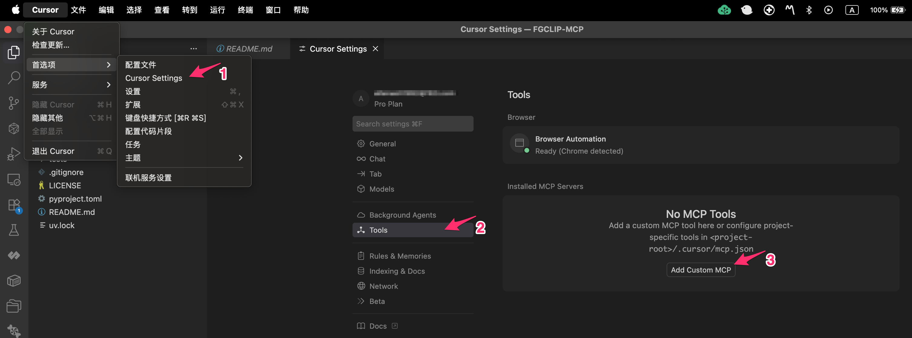
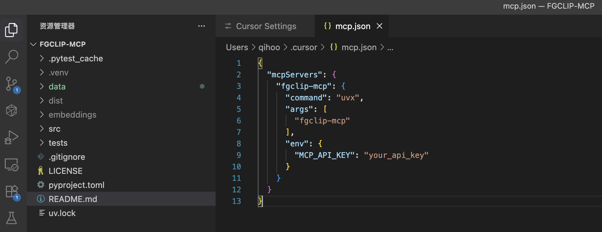
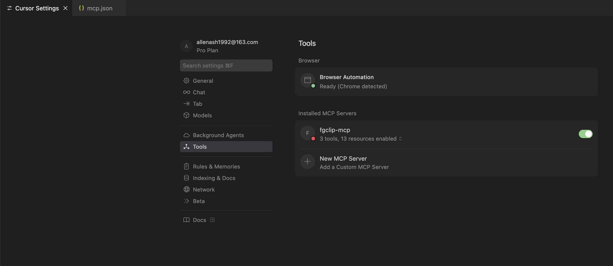
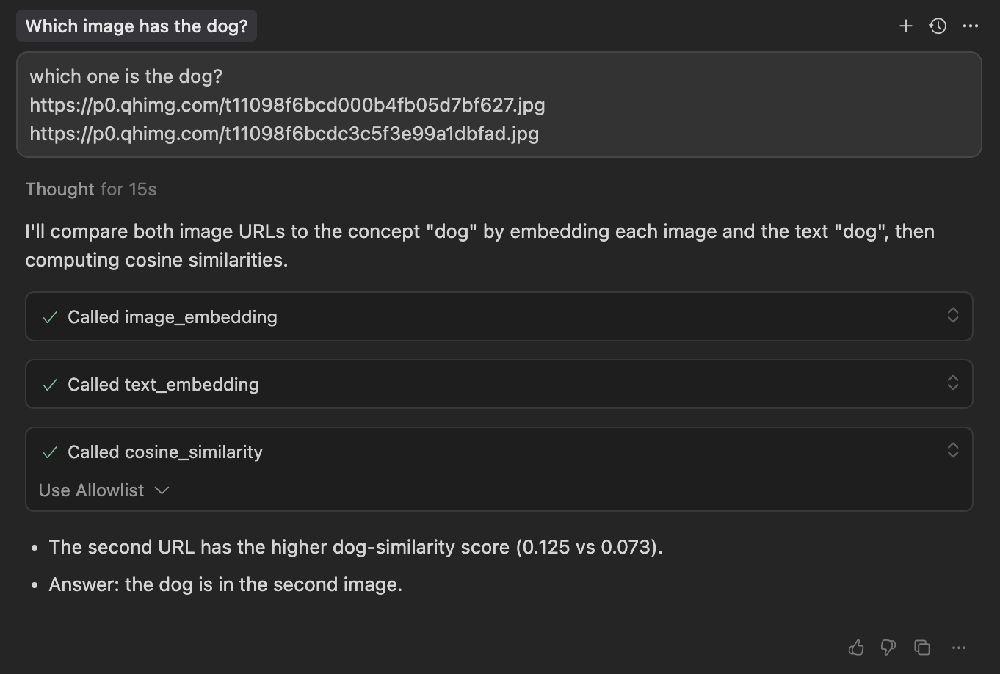

# FGCLIP-MCP

MCP (Model Context Protocol) server for [FG-CLIP](https://github.com/360CVGroup/FG-CLIP) embedding services. To obtain and configure the API key, please apply at `https://research.360.cn/sass`.

## Features

This MCP server provides the following tools and resources:

### Tools
- **text_embedding**: Generate embedding vectors for text
- **image_embedding**: Generate embedding vectors for images  
- **cosine_similarity**: Compute cosine similarity between two lists of vectors

### Use Cases

This MCP server helps users achieve the following capabilities:

- **Image Feature Extraction**: Convert images into high-dimensional vector representations for machine learning and similarity computation
- **Text Feature Extraction**: Transform text into semantic vector representations with multi-language support
- **Multi-modal Similarity Computation**: 
  - **Image-to-Image Similarity**: Compare visual similarity between different images
  - **Image-to-Text Similarity**: Enable cross-modal retrieval, such as finding relevant images based on text descriptions
  - **Text-to-Text Similarity**: Calculate semantic similarity between texts

Through these capabilities, users can build powerful search engines, recommendation systems, content classification, and multi-modal AI applications.


## Tool Details

### text_embedding

Generate embedding vectors for input texts.

Parameters:
- `texts`: A list of text strings to embed
- `model`: The model to use (default: "fg-clip")

Returns:
- `saved_uris`: A list of URIs where the embeddings are stored
- `success`: Whether the operation succeeded
- `error_msg`: Error message, if any

### image_embedding

Generate embedding vectors for images.

Parameters:
- `images`: A list of image URLs or base64-encoded images
- `model`: The model to use (default: "fg-clip")

Returns:
- `saved_uris`: A list of URIs where the embeddings are stored
- `success`: Whether the operation succeeded
- `error_msg`: Error message, if any

### cosine_similarity
Compute cosine similarity between two lists of vectors.

Parameters:
- `uris_a`: A list of URIs for the first set of embeddings
- `uris_b`: A list of URIs for the second set of embeddings
- `mode`: Calculation mode (default: "pairwise")
  - `"pairwise"`: Compute similarity for vectors at corresponding positions
  - `"matrix"`: Compute a full similarity matrix for all vector pairs

Returns:
- `similarities`: Similarity values or a similarity matrix
- `shape`: Shape information of the result
- `success`: Whether the operation succeeded

## Development & Testing
```bash
git clone https://github.com/360CVGroup/FGCLIP-MCP 
cd FGCLIP-MCP
uv venv
uv sync
source .venv/bin/activate
export MCP_API_KEY=your_api_key 
pytest -q
```


## MCP Host Configuration

### From pypi

```json
{
  "mcpServers": {  
    "fgclip-mcp": {
      "command": "uvx",
      "args": [
        "fgclip-mcp"
      ],
      "env": {
        "MCP_API_KEY": "your_api_key"
      }
    }
  }
}
```

### From local
```json
{
  "mcpServers": {  
    "fgclip-mcp-local": {
      "command": "uv",
      "args": [
        "--directory",
        "/path_to_fgclip-mcp/src/fgclip_mcp",
        "run",
        "/path_to_fgclip-mcp/src/fgclip_mcp/__main__.py"
      ],
      "env": {
        "MCP_API_KEY": "your_api_key"
      }    
    }
  }
}

```

### Use Case in [Cursor IDE](https://cursor.com/download)

**Locate MCP Setting**


**Config MCP Setting**


**Enable MCP**


**Chat with MCP**

**Example: Searching for images based on given text**


<div style="display: flex; gap: 10px;">
  
  
</div>

**Image URLs:**
- https://p0.qhimg.com/t11098f6bcd000b4fb05d7bf627.jpg
- https://p0.qhimg.com/t11098f6bcdc3c5f3e99a1dbfad.jpg

## License

Apache License 2.0